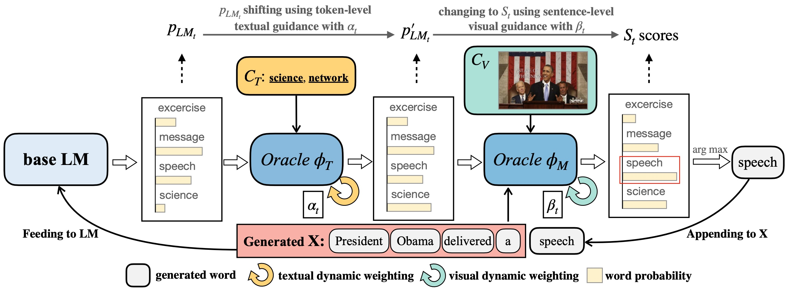

# ZeroGen: Zero-shot Multimodal Controllable Text Generation with Multiple Oracles
Official PyTorch implementation of ZeroGen: Zero-shot Multimodal Controllable Text Generation with Multiple Oracles (https://arxiv.org/abs/2306.16649), accepted to NLPCC 2023.



## Setup

Make sure you have installed:
```bash
transformers
nltk
scikit-learn
torch
numpy
tqdm
```

## Data and Model Weights

### Data Structure

The [extra data](https://drive.google.com/drive/folders/1XHviYZnrX3KNqSKvUwkoHsxmeSFP5Jgn?usp=sharing) contains:

1. Objects, textual features, ect. for MSCOCO, Flickr30k, Flickr10k, VisNews.
2. The training/test data for Flickr10k and VisNews.
3. `evaluation` suite for captioning and text control evaluations.
4. `npy_data` folder for extracted GloVe features.

### Data Processing and Preparation

For processing these data and obtain the whole test data:

1. For the test data (images and captions) of MSCOCO and Flickr30k, please refer to the downloading details from [this repository](https://github.com/yxuansu/MAGIC). Put the datasets to the path you wish and change the `DATA_DIR` in `config.json` file accordingly.
2. For the test images of ViseNews, please refer to their official [repository](https://github.com/FuxiaoLiu/VisualNews-Repository) to donwload. Move the `visnews` folder to your data path, and images to the same `visnews` directory.
3. Move all files in `flickr30_data_zerogen` and `mscoco_data_zerogen` to the Flicrk30k and MSCOCO folders, respectively.
4. Move `flickr10_data_zerogen` and `visnews_data_zerogen` to data directory.
5. Put the `evaluation` folder to the current directory.

Note that, for all data employed, please follow their licenses for any other purpose.


### Model Weights

| Task               | Weight                                                   |
| :----------------- | :------------------------------------------------------- |
| MSCOCO             | https://huggingface.co/cambridgeltl/magic\_mscoco        |
| Flickr30k          | https://huggingface.co/cambridgeltl/magic\_flickr30k     |
| Flickr10k-romantic | https://huggingface.co/PahaII/ZeroGen-flickr10k-romantic |
| Flickr10k-humor    | https://huggingface.co/PahaII/ZeroGen-flickr10k-humor    |
| VisNews            | https://huggingface.co/PahaII/ZeroGen-visnews            |

## ZeroGen Generation

```bash
TASK=mscoco
LENGTH=16
ALPHA=1.0
BETA=1.0
ETA=0.10
K=45
ALPHA_HAT=2.5
BETA_HAT=1.0
N=1

python run_zerogen.py --alpha ${ALPHA} --beta ${BETA} --eta ${ETA} --k ${K} --condition_method add \
                       --task ${TASK} --decoding_len ${LENGTH} --alpha_scale --alpha_activasize ${ALPHA_HAT}  \
                       --beta_scale --beta_activesize 0.2 --beta_upper ${BETA_HAT} --n_obj ${N} --kw_mode max --k2t
```

Here are recommended parameters for ZeroGen generation:

| Task               | $k$ | $\alpha$ | $\beta$ | $\eta$ | $\hat{\alpha}$ | $\hat{\beta}$ | $N$ | length
| :----------------- | :---- | :---------- | :--------- | :-------- | :----------------- | :---------------- | :---- | :---- |
| MSCOCO             | 45    | 1\.0        | 1\.0       | 0\.10     | 2\.5               | 1\.0              | 1~5   | 16
| Flickr30k          | 25    | 2\.0        | 1\.0       | 0\.10     | 2\.0               | 0\.5              | 1~5   | 16
| Flickr10k-romantic | 45    | 1\.0        | 1\.0       | 0\.10     | 3\.0               | 0\.5              | 1     | 25
| Flickr10k-humor    | 45    | 1\.0        | 1\.0       | 0\.10     | 2\.5               | 0\.5              | 1     | 25
| VisNews            | 5     | 8\.0        | 1\.0       | 0\.65     | 8\.0               | 0\.5              | 40    | 64

We also support the inference of sequence-to-sequence models like [FlanT5](https://huggingface.co/google/flan-t5-base), just add `--seq2seq` flag and specify the model name via `--language_model_name` argument.

## Baseline Models

For [CapDec](https://github.com/DavidHuji/CapDec), [ZeroCap](https://github.com/YoadTew/zero-shot-image-to-text), [MAGIC](https://github.com/yxuansu/MAGIC) baselines in captioning tasks, please refer to their official repositories.

For PPLM+MAGIC baseline in controllable news generation task, we provide a minimal implementation in the `Pplm_Magic` folder.

## Citation

If you find our work useful, please consider cite our paper and star the repo :)

```bibtex
@article{tu2023zerogen,
  title={ZeroGen: Zero-shot Multimodal Controllable Text Generation with Multiple Oracles},
  author={Tu, Haoqin and Yang, Bowen and Zhao, Xianfeng},
  journal={arXiv preprint arXiv:2306.16649},
  year={2023}
}
```

Please [email](tuisaac163@gmail.com) me or open an issue if you have further questions. We thank open sourced codes related to zero-shot captioning and plug-and-play models, which inspired our work!